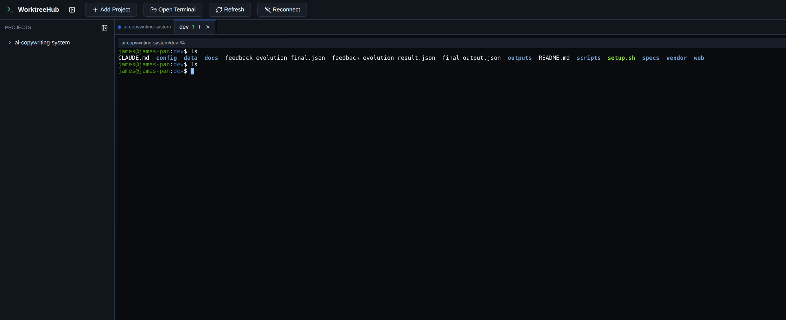

# WorktreeHub

> 本地优先的 Git worktree 工作台：在一个网页里管理项目、分支、worktree 和真实终端。

[项目官网](https://worktreehub.mogician.me/) · [问题反馈](https://github.com/panjiangyi/worktreehub/issues)



当你同时维护多个功能分支、修复线上问题，或让多个 AI coding 任务并行工作时，普通终端窗口很快就会失去上下文。WorktreeHub 把每个 worktree 和对应的终端会话组织在一起，让分支、目录和正在运行的任务都有明确的位置。

## 核心功能

- 在一个侧边栏中管理多个 Git 项目及其 worktree
- 创建、切换、重命名和删除 worktree
- 自动识别主分支，并支持选择基础分支创建 worktree
- 为每个项目配置 setup 脚本，新 worktree 创建后自动初始化
- 在浏览器中打开绑定到 worktree 的真实终端
- 页面刷新后恢复终端会话；浏览器断开时，后端任务继续运行
- 支持多个终端分屏，方便同时查看不同任务
- 使用 xterm.js 本地回滚缓冲，提供自然的鼠标滚轮和触屏滚动体验
- 针对手机提供方向键、`Tab`、`Esc`、`Enter`、`Ctrl+C` 等快捷按钮
- 所有项目数据保存在本地 SQLite 数据库中

## setup 脚本

新 worktree 创建完成后，通常还要重复安装依赖、复制环境变量、迁移数据库和启动开发服务。WorktreeHub 可以为每个项目保存一段 setup 脚本，并在新 worktree 中自动打开可见终端执行它。

例如：

```bash
pnpm install
cp ../main/.env.local .env.local
pnpm run db:migrate
pnpm run dev
```

脚本输出会直接显示在终端中。如果初始化失败，不会删除已经创建的 worktree，可以在终端中查看错误并继续处理。

## 环境要求

- Node.js 22 LTS，版本约束见 `.nvmrc`
- pnpm 10，推荐通过 Corepack 启用
- macOS 或 Linux；v1 暂不支持 Windows
- 本机已安装 Git

## 快速开始

```bash
git clone https://github.com/panjiangyi/worktreehub.git
cd worktreehub

corepack enable
pnpm install
cp .env.example .env
```

打开根目录下的 `.env`，至少设置登录用户名和密码：

```dotenv
WORKTREEHUB_AUTH_USERNAME=admin
WORKTREEHUB_AUTH_PASSWORD=请替换为强密码
```

启动前后端开发服务：

```bash
pnpm dev
```

- 前端开发地址：`http://127.0.0.1:5173`
- 后端地址：`http://127.0.0.1:3767`
- 只启动前端：`pnpm dev:web`
- 只启动后端：`pnpm dev:server`

## 生产构建与启动

```bash
pnpm build-and-start
```

该命令会完成构建、数据库迁移并启动服务。默认监听所有网络接口，终端会输出类似 `http://192.168.1.10:3767` 的局域网地址。

在同一 Wi-Fi 下，可以直接用手机打开该地址。生产模式下，后端会从同一个来源提供前端页面、API 和 WebSocket，移动浏览器不会错误连接到手机自己的 `127.0.0.1`。

## 远程访问

WorktreeHub 的终端由后端持有。只要后端仍在运行，即使关闭网页或切换设备，正在执行的构建、测试和脚本也不会因为浏览器断开而停止。重新打开网页后，可以继续进入原来的 worktree 上下文。

WorktreeHub 面向可信的个人开发环境。若需要从公网访问，请在前面部署 HTTPS、反向代理以及额外的访问控制，不要直接把服务端口暴露到公网。

## 常用命令

```bash
pnpm test       # 运行全部测试
pnpm typecheck  # TypeScript 类型检查
pnpm lint       # 代码检查
pnpm test:e2e   # 运行服务端端到端测试
pnpm build      # 构建全部工作区
```

## 项目结构

WorktreeHub 使用 pnpm workspace 管理三个主要包：

```text
worktreehub/
├── apps/
│   ├── server/       # Fastify、SQLite、node-pty 和 Git 集成
│   └── web/          # React、Vite、Zustand 和 xterm.js
├── packages/
│   └── shared/       # 前后端共享类型与 WebSocket 协议
├── build-and-start.sh
└── package.json
```

worktree 终端和目录终端由后端的长期 `node-pty` 会话提供。浏览器通过 WebSocket 发送输入、接收输出，xterm.js 负责终端渲染、本地回滚缓冲和视口状态。

## 配置

服务端从项目根目录的 `.env` 读取配置：

| 环境变量 | 默认值 | 说明 |
|---|---|---|
| `WORKTREEHUB_AUTH_USERNAME` | 无 | 登录用户名，必填 |
| `WORKTREEHUB_AUTH_PASSWORD` | 无 | 登录密码，必填 |
| `WORKTREEHUB_HOST` | `127.0.0.1` | 服务监听地址 |
| `WORKTREEHUB_PORT` | `3767` | 服务监听端口 |
| `WORKTREEHUB_DB` | `~/.worktreehub/worktreehub.sqlite` | SQLite 数据库路径 |
| `WORKTREEHUB_TRUST_PROXY` | `1` | 是否信任反向代理转发信息；设为 `0` 可关闭 |
| `WORKTREEHUB_AUTH_SESSION_TTL_MS` | `43200000` | 登录会话有效期，单位为毫秒 |
| `WORKTREEHUB_AUTH_IP_FAILURE_LIMIT` | `5` | 单个 IP 在统计窗口内允许的登录失败次数 |
| `WORKTREEHUB_AUTH_IP_WINDOW_MS` | `900000` | 单个 IP 登录失败统计窗口，单位为毫秒 |
| `WORKTREEHUB_AUTH_GLOBAL_FAILURE_LIMIT` | `10` | 全局登录失败次数限制 |
| `WORKTREEHUB_AUTH_GLOBAL_COOLDOWN_MS` | `900000` | 触发全局限制后的冷却时间，单位为毫秒 |
| `WORKTREEHUB_WEIXIN_ENABLED` | `0` | 设为 `1` 启用微信编码集成 |
| `WORKTREEHUB_WEIXIN_BASE_URL` | `http://127.0.0.1:3000` | 独立 `weixin-bot-service` 地址 |
| `WORKTREEHUB_WEIXIN_API_KEY` | 无 | 微信 sidecar 的 API key |
| `WORKTREEHUB_WEIXIN_ACCOUNT_ID` | 无 | 用于编码消息的 bot account id |
| `WORKTREEHUB_WEIXIN_SERVICE_ENV` | 无 | 可选：读取 sidecar `.env` 中的 `API_KEY` 和 `PORT`，避免复制密钥 |

## 微信编码

WorktreeHub 可以通过独立运行的 `weixin-bot-service` 接收微信文本和图片，并把任务交给 Codex、Claude Code、OpenCode 或自定义命令 driver。原始终端不会转发到微信；机器人只发送任务确认、阶段进度、问题和整理后的结果。

1. 启动并登录 `weixin-bot-service`。
2. 在 WorktreeHub `.env` 中配置上述四个微信变量并重启。
3. 打开 Settings，确认 Sidecar 为 Connected，点击 Pair owner。
4. 将八位配对码发送给微信 bot，然后按编号选择项目和 worktree。

集成只允许一个已绑定的微信所有者。普通消息会成为当前 worktree 的编码任务；发送“帮助”可查看项目、工作区、助手、状态、停止和详情等控制词。

## 安全说明

- 开发模式默认只监听 `127.0.0.1`
- `pnpm build-and-start` 为局域网访问监听 `0.0.0.0`
- 服务启动必须配置单用户登录用户名和密码
- 会话 Cookie 只在当前浏览器会话中有效
- Git 操作通过允许列表执行，不提供任意命令执行 API
- 路径操作限制在受管理的项目和 worktree 目录中

应用登录只能保护 WorktreeHub 自身，不能替代公网传输加密、网络防火墙或反向代理认证。项目终端拥有当前系统用户的权限，部署时应按高权限开发工具对待。

## 许可证

MIT
